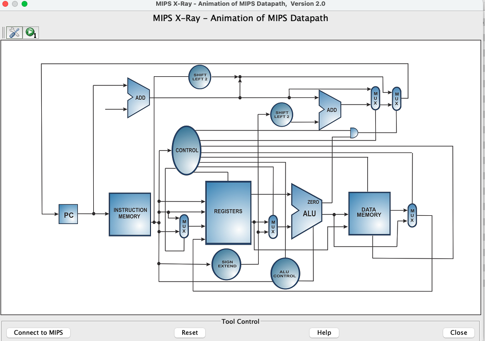
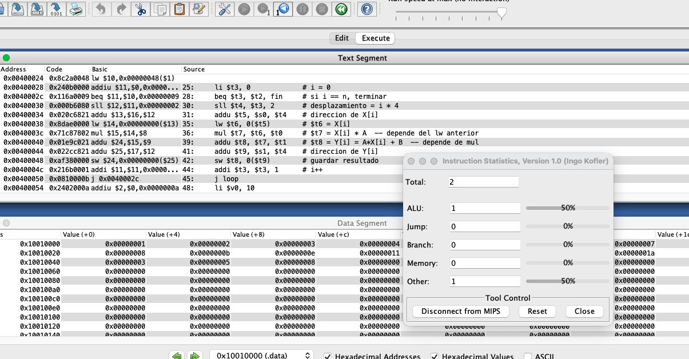
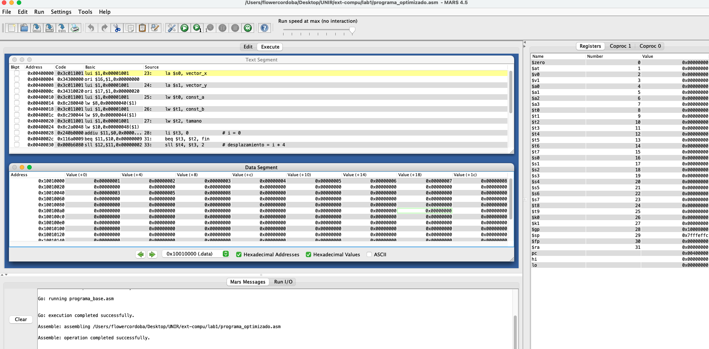
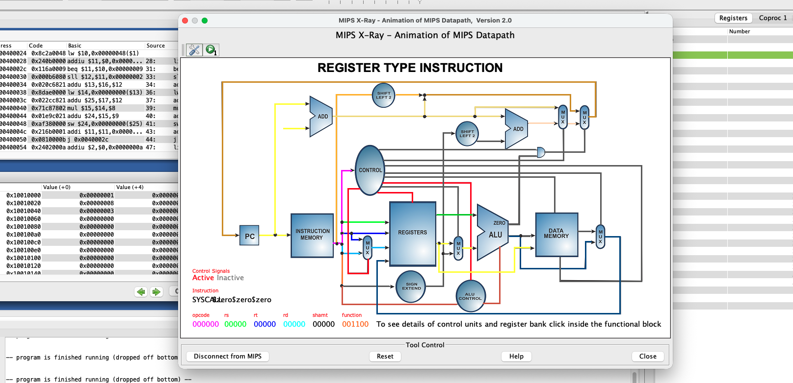
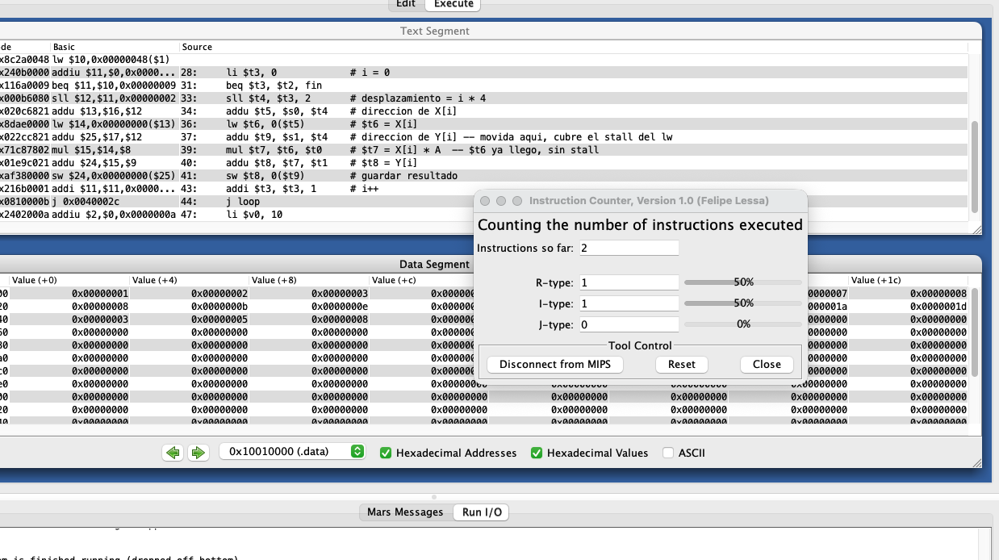
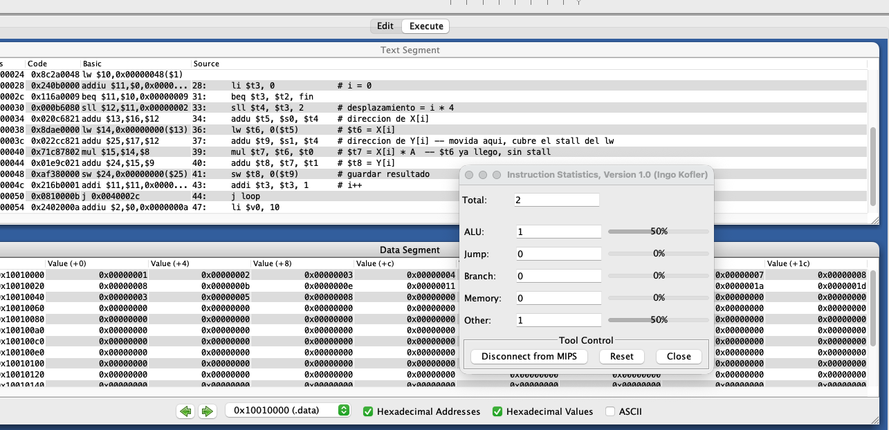

# Informe de Laboratorio: Estructura de Computadores

**Nombre del Estudiante:** Flower Cordoba  
**Fecha:** 28/02/2026  
**Asignatura:** Estructura de Computadores

**Enlace del repositorio en GitHub:** [https://github.com/flower-cordoba/lab-1-estrutura-pc-unir.git](#)

---

## 1. Análisis del Código Base

### 1.1. Evidencia de Ejecución

A continuación se adjuntan las capturas de pantalla de la ejecución del `programa_base.asm` en MARS:

- **MIPS X-Ray**.
> []
- **Instruction Counter**.
> []
- **Instruction Statistics**.


> [Inserte aquí las capturas de pantalla]

### 1.2. Identificación de Riesgos (Hazards)

En el bucle del programa base se identificaron los siguientes riesgos de datos:

| Instrucción Causante | Instrucción Afectada | Tipo de Riesgo | Ciclos de Parada |
|----------------------|----------------------|----------------|-----------------|
| `lw $t6, 0($t5)` | `mul $t7, $t6, $t0` | Load-Use | 1 |
| `mul $t7, $t6, $t0` | `addu $t8, $t7, $t1` | RAW (Write-After-Read) | 0* |

> *El riesgo RAW entre `mul` y `addu` se resuelve por forwarding; no genera stall adicional en la mayoría de implementaciones MIPS segmentadas.

El riesgo crítico es el **Load-Use Hazard**: el resultado de `lw` no está disponible hasta la etapa WB, pero `mul` lo necesita en EX. El hardware introduce 1 ciclo de parada (stall/burbuja) por cada iteración del bucle, sin posibilidad de resolverse solo con forwarding.

### 1.3. Estadísticas y Análisis Teórico

MARS es un simulador funcional, por lo que el número de instrucciones ejecutadas es el mismo en ambas versiones. El análisis de ciclos es teórico, basado en el comportamiento de un pipeline MIPS de 5 etapas real.

El bucle tiene **9 instrucciones** por iteración y corre **8 veces**, más las instrucciones de inicialización fuera del bucle (6 instrucciones).

| Métrica | Código Base | Código Optimizado |
|---------|-------------|-------------------|
| Instrucciones Totales (según MARS) | 78 | 78 |
| Stalls por iteración | 1 | 0 |
| Total de Stalls (8 iteraciones) | 8 | 0 |
| Ciclos Totales Estimados (Inst + Stalls + overhead pipeline) | 86 | 78 |
| CPI Estimado (Ciclos / Inst) | 1.10 | 1.00 |

> Nota: los ciclos de overhead de llenado/vaciado del pipeline (4 ciclos por inicio y fin) se distribuyen entre las instrucciones totales y tienen impacto despreciable en bucles de este tamaño.

---

## 2. Optimización Propuesta

### 2.1. Evidencia de Ejecución (Código Optimizado)

A continuación se adjuntan las capturas de pantalla de la ejecución del `programa_optimizado.asm` en MARS con las mismas herramientas:



- **MIPS X-Ray**.
> 
- **Instruction Counter**.
> 
- **Instruction Statistics**.



### 2.2. Código Optimizado


El fragmento del bucle `loop` reordenado es el siguiente:

```asm
loop:
    beq $t3, $t2, fin

    sll $t4, $t3, 2       # desplazamiento = i * 4
    addu $t5, $s0, $t4    # direccion de X[i]

    lw $t6, 0($t5)        # $t6 = X[i]
    addu $t9, $s1, $t4    # direccion de Y[i] -- movida aqui, cubre el stall del lw

    mul $t7, $t6, $t0     # $t7 = X[i] * A  -- $t6 ya llego, sin stall
    addu $t8, $t7, $t1    # $t8 = Y[i]
    sw $t8, 0($t9)        # guardar resultado

    addi $t3, $t3, 1      # i++
    j loop
```

### 2.3. Justificación Técnica de la Mejora

En el código base, la instrucción `addu $t9, $s1, $t4` (que calcula la dirección de escritura de `Y[i]`) estaba ubicada después del `mul` y del `addu` que produce el resultado. Esa instrucción no usa el registro `$t6` que carga el `lw`, por lo que es completamente independiente del hazard.

Al moverla al slot inmediatamente posterior al `lw`, ocupa el ciclo que de otra forma sería una burbuja. Cuando el pipeline llega a `mul`, ya transcurrió un ciclo desde que `lw` comenzó a escribir su resultado, y el dato está disponible vía forwarding desde MEM/WB. El stall desaparece sin alterar la lógica del programa.

En resumen: se aprovecha el **instruction scheduling** para rellenar el delay slot del `lw` con trabajo útil, eliminando el único stall del bucle.

---

## 3. Comparativa de Resultados

| Métrica | Código Base | Código Optimizado | Mejora (%) |
|---------|-------------|-------------------|------------|
| Ciclos Totales | 86 | 78 | ~9.3% |
| Stalls (Paradas) | 8 | 0 | 100% |
| CPI | 1.10 | 1.00 | ~9.1% |

El resultado del vector `Y` fue idéntico en ambas versiones:
`Y = {8, 11, 14, 17, 20, 23, 26, 29}`, verificado en el Data Segment de MARS.

---

## 4. Conclusiones

La segmentación (pipelining) permite que varias instrucciones se ejecuten en paralelo superponiéndose en distintas etapas del procesador, lo que aumenta el rendimiento de forma considerable. Sin embargo, introduce dependencias de datos que el hardware no siempre puede resolver sin parar el flujo de instrucciones.

El caso del Load-Use Hazard es un buen ejemplo de ese límite: el forwarding no alcanza porque el dato de memoria todavía no existe cuando la instrucción dependiente lo necesita. La solución no es hardware sino software: el compilador (o el programador) puede reordenar instrucciones independientes para cubrir ese hueco sin perder ciclos.

Lo más importante que se aprende con este ejercicio es que escribir código de bajo nivel no solo implica que funcione correctamente, sino que hay que pensar en cómo el hardware lo ejecuta. Una instrucción de diferencia en el orden puede significar stalls en cada iteración de un bucle, y en bucles grandes eso se traduce en una diferencia real de rendimiento.

No siempre es posible eliminar todos los stalls. Si no existe ninguna instrucción independiente disponible para llenar el delay slot, el programador debe insertar un `nop` y asumir el ciclo perdido. En ese caso, la única alternativa es rediseñar el algoritmo o confiar en que el hardware tenga mecanismos adicionales como out-of-order execution.
